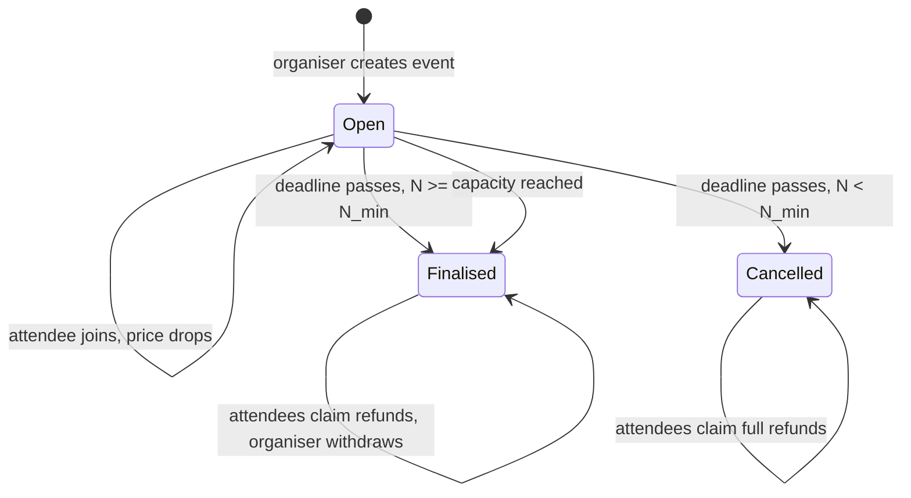
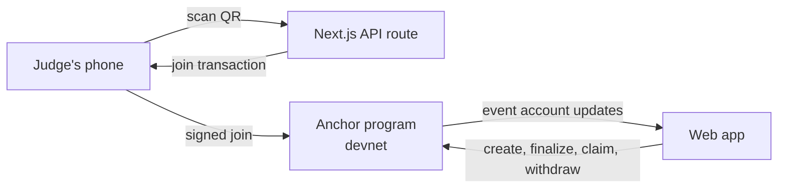

# Fairshare: Crowd-Priced Events (PRD)

Sep 26, 2026 · @Krystian

## Overview

**Pitch:** Fairshare is reverse dynamic pricing for events: the more people sign up, the cheaper it gets for everyone, and early buyers are automatically refunded down to the final price.

**Problem:** Dynamic pricing today only ever pushes prices up when demand is high. For events where most of the cost is fixed (venue, bus, band), that's backwards: more attendees should mean a lower cost per head. Organisers can't easily pass those savings on, and attendees have no reason to trust that they would.

**Insight:** If the price formula is public and the money sits in escrow, nobody loses by buying early, and every new sign-up lowers the price for everyone already in. Each buyer has a reason to share the link, so growth is built into the product.

**Why Solana:** hundreds of small, instant refunds that cost next to nothing; a pricing formula enforced by a program rather than an organiser's word; and escrow that guarantees full refunds if the event doesn't hit its minimum.

## Goals and non-goals

The hackathon goal is one full event lifecycle working live on devnet: create, join, price drops, finalise, refunds claimed.

**Goals (by 6pm)**

- Organiser creates an event with cost parameters, capacity, minimum, and deadline
- Attendees join by paying the current price in USDC, including judges scanning a QR live
- Price updates onchain with every join and is shown live on screen
- After finalise, every attendee claims a refund down to the final price; organiser withdraws their share

**Non-goals**

- Ticket scanning or entry at the venue
- Transferable or resellable tickets
- Mainnet, fiat on-ramps, or KYC
- Native mobile app (responsive web is enough)

## Users

Two roles. The target organiser covers costs rather than maximising profit.

| Role | Who | Wants | Does in Fairshare |
| --- | --- | --- | --- |
| Organiser | Student societies, community groups, trip and class organisers | Costs covered with no risk of a loss | Sets costs, margin, capacity, minimum, deadline; withdraws after finalise |
| Attendee | Students, locals, group-trip joiners | The lowest fair price, no penalty for buying early | Joins, shares the link, claims refund after finalise |

## Pricing algorithm

The price is the organiser's cost per head plus margin, clamped between a floor and a cap, so it falls as more people split the fixed cost.

```
price(n) = clamp( (F / n + c) × (1 + m), P_min, P_max )
```

| Parameter | Meaning | Example |
| --- | --- | --- |
| F | Fixed cost (venue, band, bus) | €2,000 |
| c | Cost per attendee (food, wristband) | €5 |
| m | Organiser margin | 10% |
| P\_max | Starting price cap | €50 |
| P\_min | Floor price | €10 |
| N\_min | Minimum attendees to go ahead | 50 |
| N\_max | Capacity | 400 |

**Worked example**

| Sign-ups (n) | Price each | Organiser receives |
| --- | --- | --- |
| 50 | €49.50 | €2,475 |
| 100 | €27.50 | €2,750 |
| 200 | €16.50 | €3,300 |
| 400 | €11.00 | €4,400 |

**Rules**

- **Everyone pays the same final price.** Each attendee deposits price(n) at the moment they join; the final price is price(N\_final) and each refund is deposit minus final price. Price only falls, so refunds are never negative.
- **Organiser always covers costs.** Unclamped, N × price(N) = (F + cN)(1 + m). Validation at creation: P\_max must be at least price(N\_min), otherwise the cap would sell below cost.
- **All-or-nothing.** If N\_final is below N\_min at the deadline, every attendee gets a full refund.
- **Integer maths.** Work in USDC base units (6 decimals) and round the price up, so the vault can never end up short.

**UI note:** show the next price drop as a tier ("price falls to €25 at 120 people, 14 to go") with a progress bar, while the program uses the smooth formula underneath.

## Event lifecycle

All money sits in the event's vault until finalise; after that, attendees pull their refunds and the organiser pulls their share.



Refunds use a claim pattern: each attendee calls claim\_refund themselves rather than the program looping over everyone, because a single Solana transaction can't process hundreds of accounts.

## Features

Build top to bottom and freeze at 4:30pm.

| Priority | Feature | Notes |
| --- | --- | --- |
| Must | Create event form (costs, margin, cap, floor, min, capacity, deadline) | Validates P\_max ≥ price(N\_min) |
| Must | Event page with live price, attendee count, next tier progress bar | Poll or subscribe to the event account |
| Must | Join with Phantom (pays current price in devnet USDC) |  |
| Must | Solana Pay QR to join | The judges-join-live moment |
| Must | Finalise + claim refund + organiser withdraw | Show Explorer links |
| Must | Price curve chart on the event page | Makes the formula visible to judges |
| Stretch | Cancel path with full refunds below N\_min | Short deadline in the demo |
| Stretch | "Your refund so far" shown to each attendee | Great for sharing |
| Roadmap | Blinks so events can be joined straight from a post | Distribution |
| Roadmap | Referral tracking | Rewards sharers |
| Roadmap | Other use cases: group trips, bulk buys, classes | Same program, different templates |

## Solana program design

One Anchor program, three account types, five instructions. The price is computed onchain in every join so nobody can fake it.

**Accounts**

| Account | Seeds | Fields |
| --- | --- | --- |
| Event (PDA) | "event", organiser, event\_id | organiser, F, c, m (basis points), P\_min, P\_max, N\_min, N\_max, deadline, attendee\_count, final\_price, status, organiser\_withdrawn |
| Vault (token account owned by a PDA) | "vault", event | Holds all USDC for the event |
| Ticket (PDA) | "ticket", event, attendee | attendee, amount\_paid, refund\_claimed |

The Ticket PDA doubles as proof of attendance and stops the same wallet joining twice.

**Instructions**

| Instruction | Signer | Effect |
| --- | --- | --- |
| create\_event | Organiser | Validates params, creates Event + Vault, status Open |
| join | Attendee | Computes price(count + 1), transfers it to Vault, creates Ticket, increments count |
| finalize | Anyone | After deadline or at capacity: sets final\_price and status Finalised, or Cancelled if below N\_min |
| claim\_refund | Attendee | Pays amount\_paid minus final\_price (or full amount if Cancelled), marks claimed |
| withdraw | Organiser | Once, after Finalised: takes attendee\_count × final\_price |

Edge case to test: the organiser's withdrawal plus every refund must equal the vault balance exactly. Rounding the price up guarantees any leftover dust stays in the vault rather than going short.

## Tech stack

No backend needed for the core loop: the frontend talks straight to the program, which keeps the build small.

| Layer | Choice | Why |
| --- | --- | --- |
| Frontend | Next.js + Tailwind, Solana wallet adapter (Phantom), Recharts for the price curve | Fast to scaffold, works on phones |
| Payments | Solana Pay transaction request for QR joining | Judges join from their own phones |
| Chain | Anchor 1.x program on devnet, devnet USDC | Escrow, pricing, state |
| Small API route | Next.js API route serving the Solana Pay transaction | Only server code needed |
| Hosting | Vercel | Public URL for judges |
| Optional | Claude API to draft an event's cost breakdown from a plain description | Nice use of Claude if time allows |



## Demo script (3 minutes)

The judges join from their phones and watch the price fall with each join; the refunds landing is the close.

1. **0:00** Hook: when demand for a gig goes up, the price goes up. What if it went down instead?
2. **0:20** Problem: fixed-cost events get cheaper per head as they grow, but attendees never see that saving
3. **0:40** Live: a demo event ("Society trip, €2,000 bus + €5 each") on screen with its price curve; QR up
4. **1:00** Judges scan and join; price drops on the big screen with every join; show a pre-seeded early buyer who paid more
5. **1:50** Finalise; the early buyer and each judge claim refunds; Explorer links shown; organiser withdraws exactly costs + margin
6. **2:20** Why Solana: instant near-free refunds, public formula enforced by the program, all-or-nothing escrow
7. **2:40** Scale: trips, bulk buys, classes; every buyer is a promoter because sharing lowers their own price

- [ ] Seed the demo event with a few early joins from test wallets so the price is already dropping
- [ ] Use a deadline of a few minutes so finalise can happen live
- [ ] Spare phones with Phantom and devnet USDC for judges who don't have it
- [ ] Record a 60-second backup video of the full flow

## Risks and open questions

The biggest pitch risk is "why would an organiser want lower prices?"; the biggest build risk is rounding and vault accounting.

| Risk | Mitigation |
| --- | --- |
| Organisers who want profit won't use it | Target cost-covering organisers (societies, trips, community events); margin is guaranteed, not maximised |
| "Why not Stripe with refunds?" | Card refunds cost fees and take days; here refunds are instant, near-free, and the formula is enforced |
| Rounding leaves the vault short | Round price up in base units; test that withdraw + all refunds ≤ vault balance |
| Organiser sets misleading costs | Costs are public on the event page; roadmap: receipts or verified venues |
| Anchor setup eats the morning | Deploy a hello-world escrow before the day; fallback to backend-held escrow |
| Wi-Fi or wallet trouble during demo | Backup video, phone hotspot, spare funded phones |

**Open questions**

- [ ] Final name (Fairshare is a placeholder)
- [ ] Demo event: society trip, gig, or class?
- [ ] Smooth price or visible tiers in the UI?

## Business model and scale

Revenue is a small fee per event; growth comes from attendees sharing links because sharing lowers their own price.

- **Platform fee:** a small percentage of the organiser's withdrawal, taken by the program at withdraw
- **Built-in virality:** every attendee has a direct financial reason to recruit more attendees
- **Markets beyond events:** society trips, coach hire, bulk buys (textbooks, energy deals), fitness classes, group bookings; same program, different templates
- **Reach:** any organiser anywhere can launch an event with no payment processor account or merchant setup

## Build timeline

Two tracks in parallel; the join instruction working on devnet by 1pm decides whether the day goes well.

| Time | Chain track | App track |
| --- | --- | --- |
| 10:00 to 10:30 | Lock scope and interfaces together | Same |
| 10:30 to 13:00 | Program: create\_event, join with pricing, finalize; tests for the price maths | Event pages, create form, price curve chart, wallet connect on mock data |
| 13:00 | Integration check: create and join a real event on devnet | Same |
| 13:00 to 15:00 | claim\_refund, withdraw, cancel path; vault accounting tests | Wire real program calls, Solana Pay QR route, live price updates |
| 15:00 to 16:30 | Full loop end to end, fix bugs together | Same |
| 16:30 | Freeze, record backup video | Deck (5 slides max) |
| 16:30 to 17:30 | Rehearse demo twice | Same |

Fallback if the program fights back at 1pm: move escrow and pricing into a server-held wallet, keep the demo identical, and pitch the onchain program as the next step.
